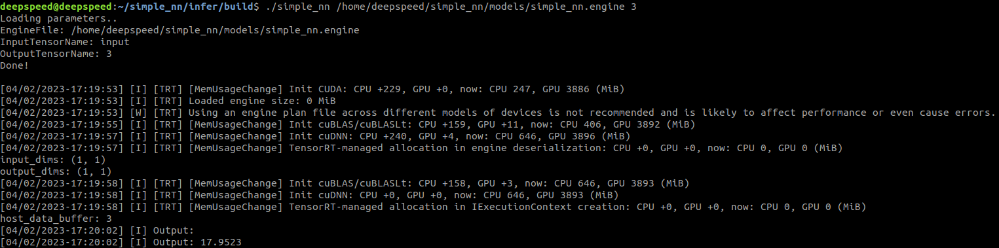

## Sample Flow for Torch-TensorRT
This example shows a single connected layer that is performing a `y = 5x + 3` operation.



## Usage
### Training 
1. Train Model
    ```sh
    cd models
    python3 train.py
    ```

### Format Conversion
1. Torch-Onnx using Torch
    ```sh
    cd ..
    python3 torch2onnx.py # saves to /models/simple_nn.onnx
    ```
2. Onnx-TensorRT using trtexec
    ```sh
    ./onnx2trt.sh # saves to /models/simple_nn.engine
    ```

### Inference
1. Compilation
    ```sh
    cd infer
    mkdir build && cd build
    cmake ..
    make
    ```
2. Infer
    ```
    ./simple_nn <path_to_engine_file> <input_value>
    ```